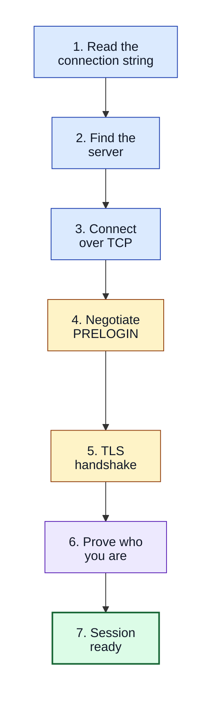
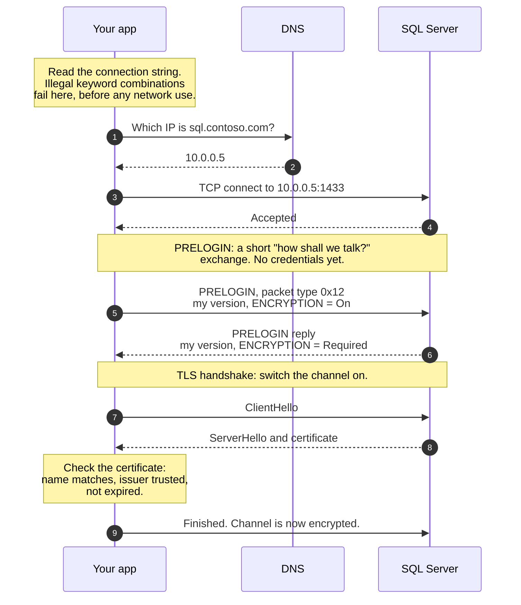
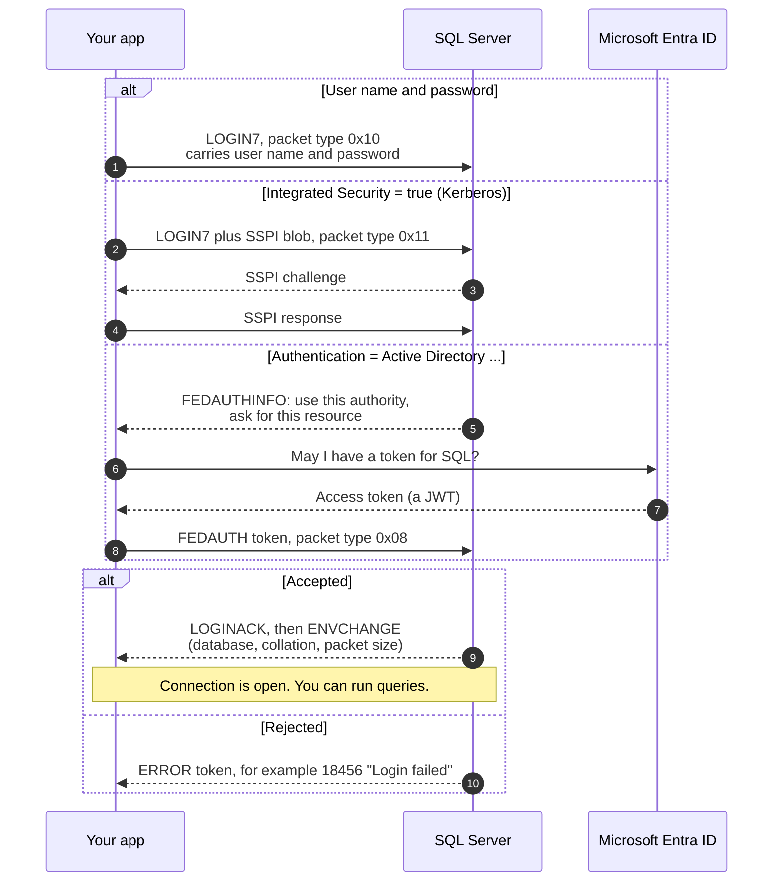
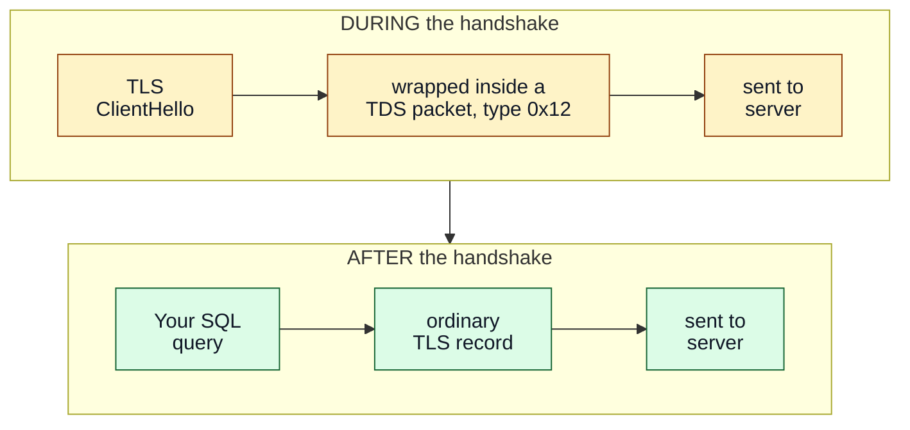
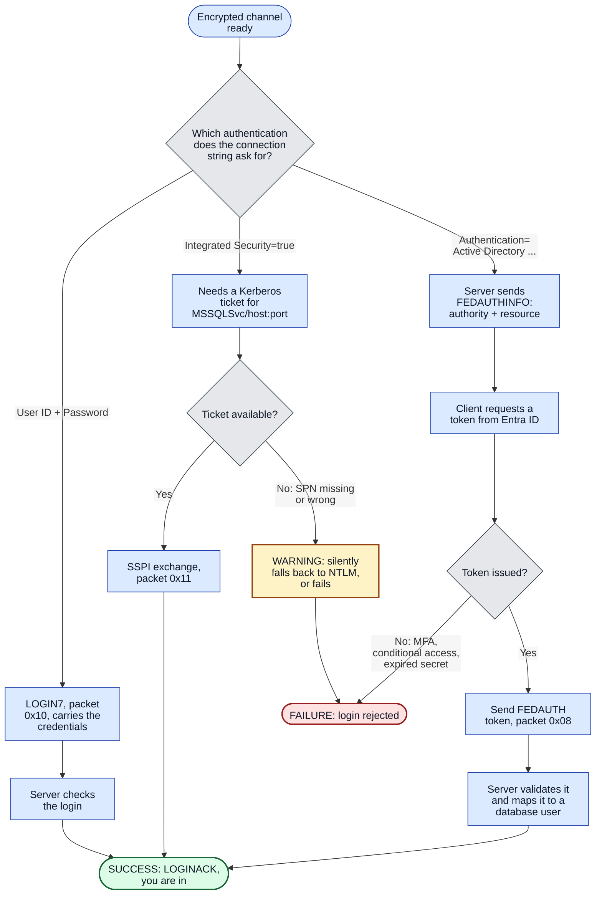
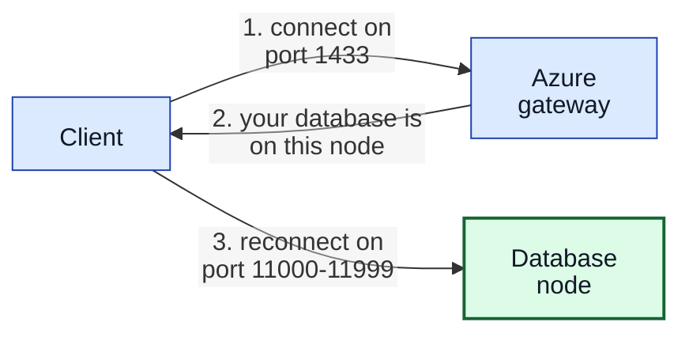

# How a SQL Server login actually works

A beginner's walkthrough of what `SqlConnection.Open()` does between the moment you call it and
the moment you can run a query.

The goal is to explain **why connection failures happen where they do**. Every step below is a
place a connection can break, and each one breaks for different reasons and needs a different fix.

**Contents**

- [The short version](#the-short-version)
- [Step 1: Read the connection string](#step-1-read-the-connection-string)
- [Step 2: Find the server](#step-2-find-the-server)
- [Step 3: Connect over TCP](#step-3-connect-over-tcp)
- [Step 4: Agree on the rules (PRELOGIN)](#step-4-agree-on-the-rules-prelogin)
- [Step 5: Turn on encryption (TLS)](#step-5-turn-on-encryption-tls)
- [Step 6: Prove who you are](#step-6-prove-who-you-are)
- [Step 7: The session opens](#step-7-the-session-opens)
- [Two failures that are not really login](#two-failures-that-are-not-really-login)
- [Where each failure lands](#where-each-failure-lands)
- [Glossary](#glossary)

---

## The short version

Opening a SQL connection is not one action. It is seven, and they always happen in this order.

The single most useful idea in this whole document:

> **Each step runs only if the one before it succeeded.**
> So "login failed" almost never means "wrong password". It means *whichever step broke first*.
> Finding that step is the entire job.

The rules these steps follow are called **TDS** (Tabular Data Stream), Microsoft's wire format for
SQL Server. It is publicly documented as MS-TDS.

---

## The conversation, end to end

Two diagrams follow. The first covers getting a secure channel open. The second covers proving
who you are. They are split deliberately — the whole exchange in one picture is hard to read.

### Part 1 — Getting a secure channel

### Part 2 — Proving who you are

The right branch depends entirely on your connection string.

---

## Step 1: Read the connection string

Before a single packet is sent, the driver checks what you gave it.

Some combinations are simply illegal. `Authentication=Active Directory Default` together with a
`Password` is rejected outright, because that mode never uses one.

This is the cheapest failure to fix, and it needs no server at all.

## Step 2: Find the server

`Server=sql.contoso.com` is a name. The network needs an address, and DNS supplies it.

Two cases need extra care:

- **Named instances.** `Server=host\SQLEXPRESS` has no fixed port. The driver asks the **SQL
  Browser** service on **UDP port 1434** which port that instance uses. UDP 1434 is blocked on
  many networks, and then this step fails even though everything else is healthy.
- **Azure SQL.** The name resolves to a *gateway*, not to your database. See
  [Azure SQL redirection](#azure-sql-redirection) below.

## Step 3: Connect over TCP

An ordinary TCP connection to port 1433, or to whatever port the Browser reported.

There are three outcomes, and telling them apart matters enormously:

| Outcome | What it means | Typical fix |
| --- | --- | --- |
| Accepted | Something is listening | — |
| **Refused** (TCP RST) | Host reachable, nothing on that port | Start the service, or correct the port |
| **Silence** until timeout | A firewall is *dropping* packets | Open the firewall or network ACL |

Refused and silent produce near-identical error messages, yet the fixes are unrelated. This is one
of the most common sources of wasted debugging time.

## Step 4: Agree on the rules (PRELOGIN)

Now the first TDS message. The client sends a small packet (**type `0x12`**) describing what it
supports, and the server answers in the same shape. No credentials are involved yet.

The field that matters most is **ENCRYPTION**. Each side states a position:

| Value | Byte | Meaning |
| --- | --- | --- |
| `Off` | `0x00` | I would rather not encrypt |
| `On` | `0x01` | I would like to encrypt |
| `NotSupported` | `0x02` | I cannot encrypt |
| `Required` | `0x03` | I insist on encryption |

If the server says `Required` and the client says `NotSupported`, the conversation ends here.

Microsoft.Data.SqlClient 4.0 and later **require encryption by default**. This is why upgrading the
driver can suddenly break a connection that worked unchanged for years.

The server also answers **FEDAUTHREQUIRED**, its way of saying "you will need a cloud token".

## Step 5: Turn on encryption (TLS)

This is ordinary TLS with one twist that surprises everyone who inspects the traffic.

**During the handshake, TLS records travel inside TDS packets.** Only afterwards do they go
directly over the socket. Hand a raw socket to a TLS library and the server never recognises the
ClientHello: it simply waits, and you get a timeout with no explanation.

Next the client validates the certificate. Most encryption failures live here:

- Does the certificate name match **the name you typed**? Connecting to `10.0.0.5` fails against a
  certificate issued for `sql.contoso.com`. Same machine, different name.
- Is the issuing authority trusted by **this client machine**?
- Has the certificate expired?

`TrustServerCertificate=true` skips every one of those checks. The error disappears, and so does
the protection: traffic is still encrypted, but you no longer know **who** you are encrypted *to*.
Treat it as a temporary diagnostic, never as a fix.

## Step 6: Prove who you are

Three mechanisms, failing for entirely different reasons.

The distinction that trips up the most people:

| Setting | Authenticates to | Needs an SPN? |
| --- | --- | --- |
| `Integrated Security=true` | **SQL Server**, via Kerberos or NTLM | Yes: `MSSQLSvc/...` |
| `Authentication=Active Directory Integrated` | **Microsoft Entra ID**, via MSAL | No |

The names are nearly identical; the machinery is completely different. Registering SPNs to fix the
second one is a guaranteed dead end.

## Step 7: The session opens

The server sends **LOGINACK**, followed by **ENVCHANGE** tokens carrying the current database,
collation, and negotiated packet size. Only now can you run a query.

---

## Two failures that are not really login

### Azure SQL redirection

Under the **Redirect** policy the client is told to reconnect on a port in the range
**11000-11999**. A firewall that permits only 1433 lets the first connection through and blocks the
second, so the connection appears to work intermittently, or works from one network but not
another.

Under the **Proxy** policy everything stays on 1433 and the problem disappears, at some cost in
latency.

### Error 18456 hides its own reason

`Login failed for user 'x'` carries a **state** that says *why*: wrong password, disabled account,
locked-out account, missing database, and so on.

For security, SQL Server **reports state 1 to the client regardless of the real state**. The true
value is written only to the **server error log**. So when you see state 1, the answer is on the
server, not in your application.

---

## Where each failure lands

This is exactly how `sqlconn-analyze` is organised: one probe per layer, in flow order, so the
first stage that fails is the actual cause.

```mermaid
%%{init: {"htmlLabels": false, "flowchart": {"htmlLabels": false}} }%%
flowchart LR
    accTitle: The nine analyzer stages in execution order
    accDescr {
        Nine stages run in a fixed order, shown as two columns. The first column is
        connection string, name resolution, TCP reachability, TDS PRELOGIN and TLS
        handshake. The second column continues with routing and redirection, credential
        acquisition, LOGIN7, and resiliency and pooling. The failure each stage detects
        is listed in the table that follows.
    }

    subgraph c1[" "]
        direction TB
        S1["1. Connection string"] --> S2["2. Name resolution"]
        S2 --> S3["3. TCP reachability"]
        S3 --> S4["4. TDS PRELOGIN"]
        S4 --> S5["5. TLS handshake"]
    end
    subgraph c2[" "]
        direction TB
        S6["6. Routing and redirection"] --> S7["7. Credential acquisition"]
        S7 --> S8["8. LOGIN7"]
        S8 --> S9["9. Resiliency and pooling"]
    end
    S5 --> S6

    style c1 fill:none,stroke:none
    style c2 fill:none,stroke:none

    classDef stage fill:#dbeafe,stroke:#1e40af,stroke-width:1px,color:#111827
    class S1,S2,S3,S4,S5,S6,S7,S8,S9 stage
```

Each stage detects a distinct class of failure:

| # | Stage | What a failure here means |
|---|-------|---------------------------|
| 1 | Connection string | Illegal keyword combination |
| 2 | Name resolution | Wrong name, DNS or VPN problem, UDP 1434 blocked |
| 3 | TCP reachability | Service down, wrong port, firewall |
| 4 | TDS PRELOGIN | Encryption cannot be agreed, or not a SQL endpoint |
| 5 | TLS handshake | Certificate name, trust, or expiry |
| 6 | Routing and redirection | Ports 11000-11999 blocked |
| 7 | Credential acquisition | No Kerberos ticket, no Entra token |
| 8 | LOGIN7 | Credentials rejected, or no access to the database |
| 9 | Resiliency and pooling | Pool exhaustion, timeouts |

> **The rule to remember:** a failure at any stage means the later stages never ran. Read the
> *first* failure, not the last error message. The last one is usually just the wreckage.

---

## Glossary

| Term | Meaning |
| --- | --- |
| **TDS** | Tabular Data Stream, the wire protocol SQL Server speaks. Documented as MS-TDS. |
| **PRELOGIN** | The opening TDS message (type `0x12`) where both sides state their capabilities. |
| **LOGIN7** | The TDS message (type `0x10`) that carries login details. |
| **FEDAUTH** | The TDS message (type `0x08`) carrying a Microsoft Entra token. |
| **SSPI** | The Windows interface used for Kerberos and NTLM authentication (packet type `0x11`). |
| **SPN** | Service Principal Name, such as `MSSQLSvc/sql.contoso.com:1433`. Kerberos uses it to identify the service being contacted. |
| **TGT** | Ticket Granting Ticket. The Kerberos ticket used to request all other tickets. |
| **JWT** | JSON Web Token, the format of an Entra access token. |
| **ENVCHANGE** | A TDS token telling the client that some session setting changed. |
| **SQL Browser** | A service on UDP 1434 that reports which port a named instance is listening on. |
